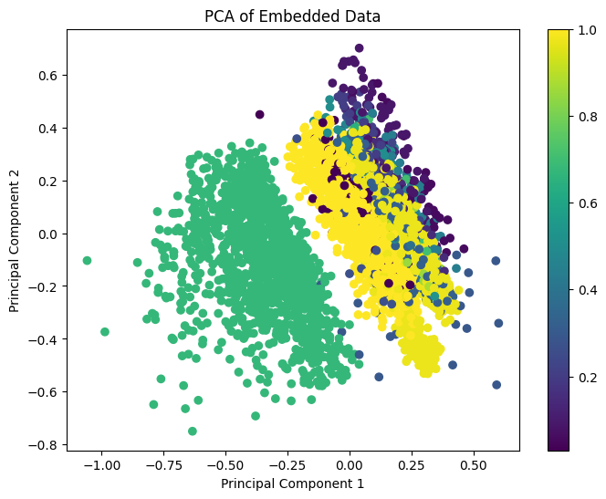
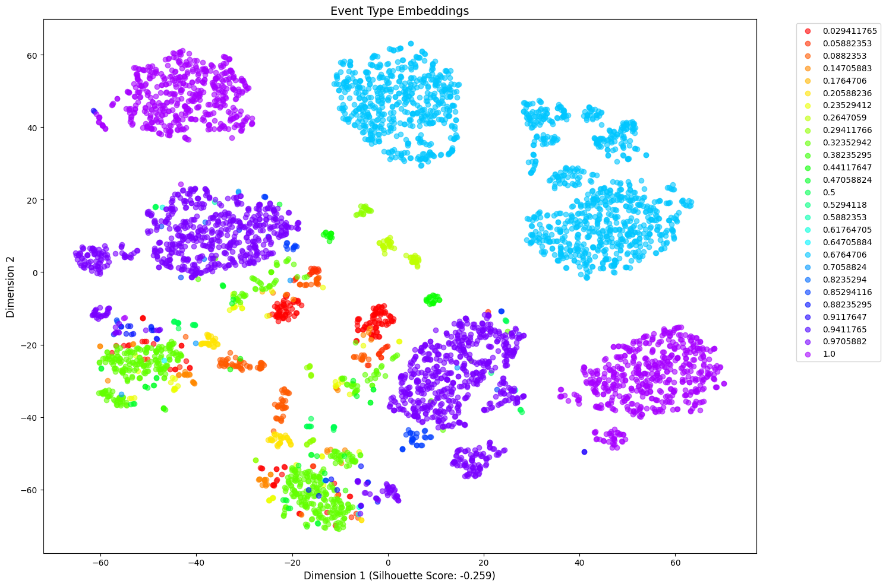

# EmbedBall
## Overview
Football_AE is a deep learning project for embedding event-level data from football (soccer) matches. 

Specifically, we trained an autoencoder on tabular event data (tokenized soccer events based on StatsBomb Open Data), aiming to learn compact representations (embeddings) that capture the structure of football events.

## Directories

* artifacts/ - Folder for storing outputs (plots, trained models, etc.) <br>
* config.py - Central config file for hyperparameters & I/O paths.<br>
* data_loading.py - Data handling: reading, concatenating, cleaning CSV files.<br>
* evaluation.py - Functions for generating embeddings & comparing reconstructions.<br>
* main.py - Main script to run the pipeline (training, evaluation, etc.)<br>
* model.py - Definition of the EventAutoencoder class.<br>
* requirements.txt - Dependencies listing.<br>
* training.py - Autoencoder training routine (train loop, dataset prep, etc.)
* visualization.py - Dimensionality reduction & plotting functions.<br>

## Installation & Requirements
* Clone this repository.<br>
* Ensure Python 3.7+ (3.8+ recommended).<br>
* Install dependencies:<br>
<code>pip install -r requirements.txt</code><br>
* This ensures you have the libraries needed: pandas, numpy, torch, matplotlib, scikit-learn, umap-learn, and tqdm.

## Data Preparation

Raw CSVs: The code expects multiple .json.csv files in the specified csv_root_dir.<br>
File Naming Convention: The provided code parses the substring .json.csv as an event-level CSV. Each file name is expected to follow the format:<br>
<code>{match_id}.json.csv</code><br>
Storage Location: Place all these CSV files in the folder of your choosing (default is csv/). Update the Config accordingly if you move them somewhere else.<br>
Example:<br>
csv/<br>
 ├── 15956.json.csv<br>
 ├── 16012.json.csv<br>
 ├── ...<br>

You can use our dataset (StatsBomb Open Data, tokenized), or upload your own. <br>
If you use your own data, make sure it is structured according to https://github.com/Amit-bt-technion/statsbomb_football_embeddings)

## Usage

### Configuration
All major hyperparameters and file paths are managed in config.py via a dataclass called Config. <br>

### Running the Pipeline
From within the football_ae/ directory, run:<br>
<code>python main.py</code><br>

This will:<br>
* Load & clean data from csv_root_dir.<br>
* Split the data into a training set (80% by default) and test set (20%).<br>
* Instantiate the autoencoder and train it for the specified number of epochs.<br>
* Save the trained model and training loss plot to the artifacts/ folder.<br>
* Generate embeddings for the test set.<br>
* Compare reconstruction quality on a random sample of events.<br>
Make sure to set <code>num_events_to_compare</code> in config.py
* Perform dimensionality reduction (PCA, t-SNE, and UMAP) and save the resulting plots.<br>

### Example usage
The following code snippet demonstrates the main pipeline - data preparation, model initialization and training:
```python
# Prepare data
X_tensor, train_dataset, test_dataset = prepare_data(df)

train_loader = DataLoader(train_dataset, batch_size=batch_size, shuffle=True)
test_loader = DataLoader(test_dataset, batch_size=batch_size)

# Initialize mpdel
input_dim = len([col for col in df.columns])
model_mse = EventAutoencoder(input_dim=input_dim, latent_dim=config.latent_dim)

# Train model
model_mse = train_model(train_loader, model_mse, test_loader, num_epochs=num_epochs, criterion=nn.MSELoss())

# Test model
embeddings_mse = get_embeddings(model_mse, test_loader)
}
```

## Logging & Outputs

Logs:<br>
View real-time training progress in your console.<br>
The default format is [TIMESTAMP] [LEVEL] [MODULE] - [message].<br>

Plots:<br>
These are the resulting plots from training an autoencoder on a subset (1/5) of the StatsBomb dataset -<br>
PCA (32->2), colored by event_id feature -<br>


T-SNE colored by event_id feature -<br>


## Contributing
We welcome contributions to improve this project. Please submit issues or pull requests on the project's GitHub repository.<br>

## Repository Authors
Ilan Zendel & Amit Ben-Tzvi

## License
This project is licensed under the MIT License.<br>

Thank you for using EmbedBall!